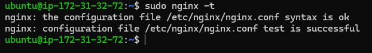

## Kays Documentation of Project 2

### INSTALLING THE NGINX WEB SERVER

Since this is our first time using apt for this session, start off by updating your server’s package index. Following that, you can use apt install to get Nginx installed:

`sudo apt update`

`sudo apt install nginx`

To verify that nginx was successfully installed and is running as a service in Ubuntu, run:

`sudo systemctl status nginx`

*First, let us try to check how we can access it locally in our Ubuntu shell, run:*

`curl http://localhost:80`

OR

`curl http://127.0.0.1:80`

*Open a web browser of your choice and try to access the following url*

`http://<Public-IP-Address>:80`

OR

`curl -s http://169.254.169.254/latest/meta-data/public-ipv4`

---

### INSTALLING MYSQL

`$ sudo apt install mysql-server`

*When the installation is finished, log in to the MySQL console by typing:*

` sudo mysql`

You should see output like this:

set a password for the root user, using mysql_native_password as default authentication method. We’re defining this user’s password as PassWord.1.

`ALTER USER 'root'@'localhost' IDENTIFIED WITH mysql_native_password BY 'PassWord.1';`

Exit the MySQL shell with:
`mysql> exit`

---

### Installing PHP

While Apache embeds the PHP interpreter in each request, Nginx requires an external program to handle PHP processing and act as a bridge between the PHP interpreter itself and the web server. This allows for a better overall performance in most PHP-based websites, but it requires additional configuration. You’ll need to install php-fpm, which stands for “PHP fastCGI process manager”, and tell Nginx to pass PHP requests to this software for processing. Additionally, you’ll need php-mysql, a PHP module that allows PHP to communicate with MySQL-based databases. Core PHP packages will automatically be installed as dependencies.

To install these 2 packages at once, run:
`sudo apt install -y php-fpm php-mysql`

---

### CONFIGURING NGINX TO USE PHP PROCESSOR

Create the root web directory for your domain as follows:

`sudo mkdir /var/www/projectLEMP`

Next, assign ownership of the directory with the $USER environment variable, which will reference your current system user:

`sudo chown -R $USER:$USER /var/www/projectLEMP`

*Then, open a new configuration file in Nginx’s sites-available directory using your preferred command-line editor. Here, we’ll use nano*

`sudo nano /etc/nginx/sites-available/projectLEMP`

This will create a new blank file. Paste in the following bare-bones configuration:

Activate your configuration by linking to the config file from Nginx’s sites-enabled directory:

`sudo ln -s /etc/nginx/sites-available/projectLEMP /etc/nginx/sites-enabled/`

You can test your configuration for syntax errors by typing:
sudo `nginx -t`

You shall see following message:

We also need to disable default Nginx host that is currently configured to listen on port 80, for this run:

`sudo unlink /etc/nginx/sites-enabled/default`

reload Nginx to apply the changes:

`sudo systemctl reload nginx`

*Your new website is now active, but the web root /var/www/projectLEMP is still empty. Create an index.html file in that location so that we can test that your new server block works as expected:*

`sudo echo 'Hello LEMP from hostname' $(curl -s http://169.254.169.254/latest/meta-data/public-hostname) 'with public IP' $(curl -s http://169.254.169.254/latest/meta-data/public-ipv4) > /var/www/projectLEMP/index.html
`

*Now go to your browser and try to open your website URL using IP address:*

[project2 website IP](http://<Public-IP-Address>:80)

    
OR

[project2 website DNS](http://<Public-DNS-Name>:80)

---

### TESTING PHP WITH NGINX

Your LEMP stack should now be completely set up.
At this point, your LAMP stack is completely installed and fully operational.
You can test it to validate that Nginx can correctly hand .php files off to your PHP processor.
You can do this by creating a test PHP file in your document root. Open a new file called info.php within your document root in your text editor:

`sudo nano /var/www/projectLEMP/info.php`

Type or paste the following lines into the new file. This is valid PHP code that will return information about your server:

*You can now access this page in your web browser by visiting the domain name or public IP address you’ve set up in your Nginx configuration file, followed by /info.php:*

[php-info-page](http://`server_domain_or_IP`/info.php)

*After checking the relevant information about your PHP server through that page, it’s best to remove the file you created as it contains sensitive information about your PHP environment and your Ubuntu server. You can use rm to remove that file:*

`sudo rm /var/www/your_domain/info.php`

---

### RETRIEVING DATA FROM MYSQL DATABASE WITH PHP (CONTINUED)

In this step you will create a test database (DB) with simple "To do list" and configure access to it, so the Nginx website would be able to query data from the DB and display it.

*We will create a database named example_database and a user named example_user, but you can replace these names with different values.*

`sudo mysql`

*To create a new database, run the following command from your MySQL console:*

`mysql> CREATE DATABASE `example_database`;`

Now you can create a new user and grant him full privileges on the database you have just created.

`mysql> CREATE USER 'example_user'@'%' IDENTIFIED WITH mysql_native_password BY 'password';`

Now we need to give this user permission over the example_database database:

`mysql> GRANT ALL ON example_database.* TO 'example_user'@'%';`

`mysql> exit`

*You can test if the new user has the proper permissions by logging in to the MySQL console again, this time using the custom user credentials:*

`mysql -u example_user -p`

After logging in to the MySQL console, confirm that you have access to the example_database database:

`mysql> SHOW DATABASES;`

This will give you the following output:

*Next, we’ll create a test table named todo_list. From the MySQL console, run the following statement:*

`CREATE TABLE example_database.todo_list (
mysql> 	item_id INT AUTO_INCREMENT,
mysql> 	content VARCHAR(255),
mysql> 	PRIMARY KEY(item_id)
mysql> );`

Insert a few rows of content in the test table. You might want to repeat the next command a few times, using different VALUES:

`mysql> INSERT INTO example_database.todo_list (content) VALUES ("My first important item");`

To confirm that the data was successfully saved to your table, run:

`mysql> SELECT * FROM example_database.todo_list;`

you'll see the following output:

`mysql> exit`

Now you can create a PHP script that will connect to MySQL and query for your content. Create a new PHP file in your custom web root directory using your preferred editor. We’ll use vi for that:

`nano /var/www/projectLEMP/todo_list.php`

*Copy this content into your todo_list.php script:*

Save and close the file when you are done editing.

You can now access this page in your web browser by visiting the domain name or public IP address configured for your website, followed by /todo_list.php:

`http://<Public_domain_or_IP>/todo_list.php`

